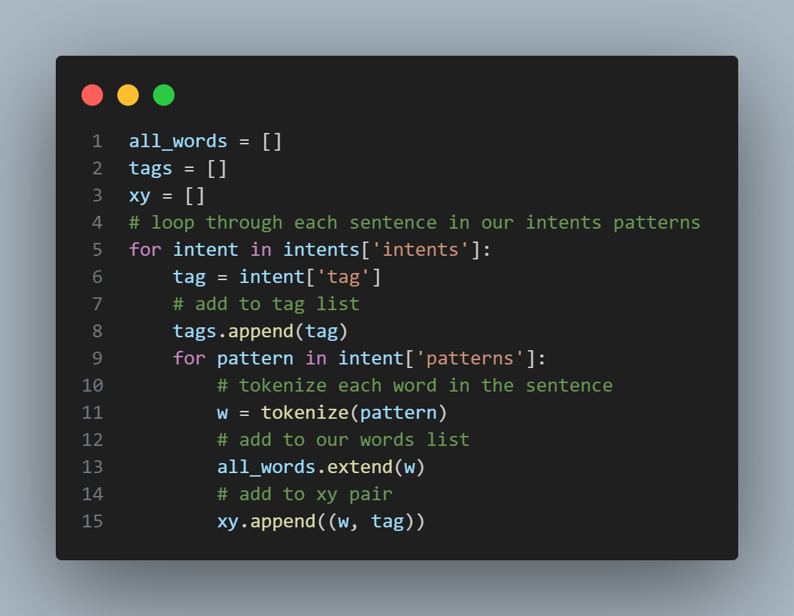
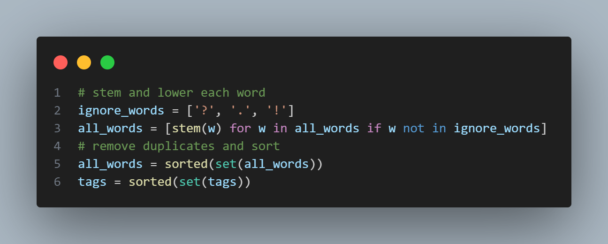
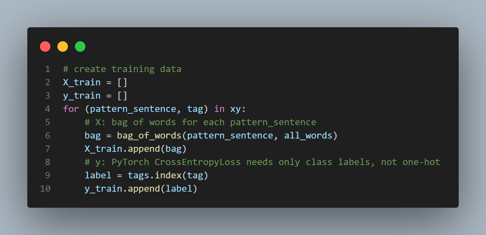
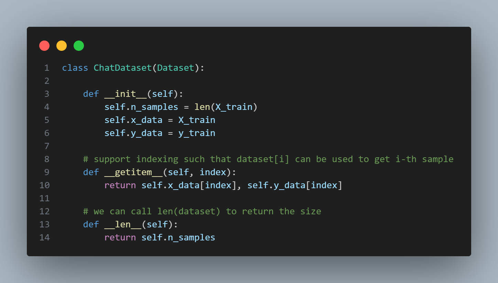
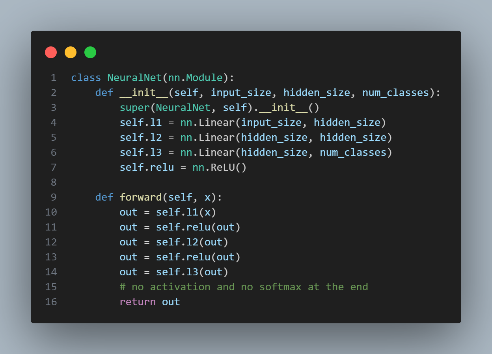
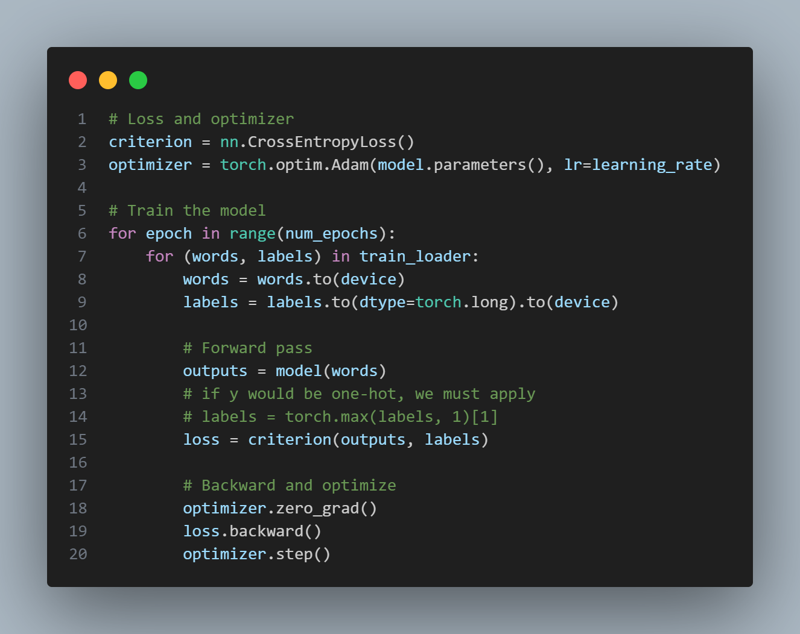
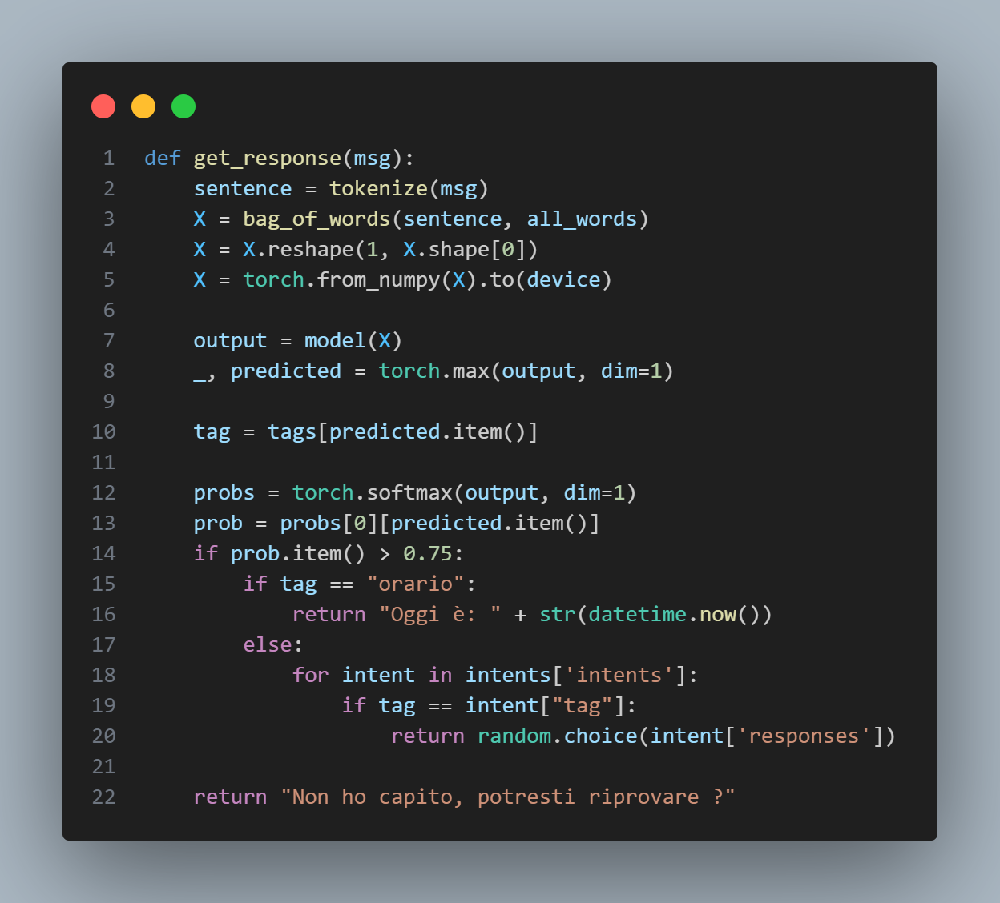

# ChatBot-ANN
ChatBot basato su rete neurale artificiale (ANN). Il bot è progettato per riconoscere le intezioni dell'utente basate su input e rispondere in modo appropriato.

[Clicca qui](https://mega.nz/folder/f5oghKIL#xaObVNHc2GXqrN07SUk_7g) se si vuole scaricare la vesione exe.

### Istruzioni per l'avvio
Per evitare conflitti di permessi è meglio creare un ambiente virtuale dove installare le librerie richieste all'interno del file `requirements.txt`.
1. Creare un ambiente virtuale nella directory di lavoro: `python -m venv venvpython -m venv venv`.
2. Attivare l'ambiente virtuale: `venv\Scripts\activate`.
3. Installare le dipendenze: `pip install -r requirements.txt`.
4. Prima di avviare `chat.py` bisogna creare il file `data.pth` eseguendo `python train.py`.
5. Avviare la chat eseguendo `python chat.py`.
6. Disattivare l'ambiente quando non lo si utilizza: `deactivate`.

## Intent JSON File
Il file `intents.json` definisce la base di conoscenza del bot. È strutturato in una lista di intezioni, ciascuna con:
  - **Tag**: Un identificatore unico per l'intezione.
  - **Patterns**: Frasi che rappresentano esempi di input dell'utente.
  - **Response**: Risposte predefinite che il bot può utilizzare.
### Funzionamento
  1. Le frasi nei patterns vengono usate per addestrare il modello.
  2. Durante l'inferenza, il bot confronta l'input dell'utente con queste frasi, cercando la probabilità di appartenenza a ciascun tag.

## Pre-elaborazione dei dati

### Descrizione 
1. Obiettivo: Creare un dataset strutturato per addestrare il modello.
2. Processo:
   -  **Tokenizzazione**: ogni frase in `patterns` viene suddivisa in parole (tokens).
   -  **Lista parole totali**: tutte le parole vengono aggiunte a `all_words`.
   -  **Coppie parola-tag**: ogni coppia `(parole, tag)` viene salvata in `xy`.

## Filtraggio e Normalizzazione

1. **Rimozione dei simboli**: si escludono caratteri inutili come `?`, `.`, `!`.
2. **Lemmatizzazione**: le parole vengono ridotte alla loro forma base.
3. **Eliminazione duplicati**: viene creata una lista di parole uniche, ordinate in ordine alfabetico.

## Creazione del Bag-Of-Words

1. **Bag-Of-Words**:
   - Ogni frase viene rappresentata come un vettore di linghezza pari al numero di parole uniche (`all_words`).
   - Ogni elemento del vettore è `1` se la parole è presente nella frase, altrimentri `0`.
2. **Etichette**:
   - Per ogni tag associato ad una frase, si salva l'indice corrispondente in `tags`.

## Creazione del Dataset

1. **Dataset personalizzato**: utilizza la libreria PyTorch per gestire i dati di addestramento.
2. **Metodi principali**:
    - `__getitem__`: restituisce un esempio (vettore bag-of-words + etichetta).
    - `__len__`: restituisce il numero di esempi. 

## Modello di Rete Neurale

1. **Layer input**: riceve il vettore bag-of-words come input.
1. **Layer nascosti**: due layer completamente connessi con attivazione ReLu.
1. **Layer di output**: restituisce un vettore di dimensione pari al numero di classi (tags).

## Addestramento

1. **Funzione di perdita**: `CrossEntropyLoss`, adatta per problemi di classificazione.
2. **Ottimizzazione** `Adam`, un algoritmo di ottimizzazione avanzato.
3. **Addestramento**:
   - per ogni batch, si calcola la perdita,
   - si eseguono il backpropagation e l'aggiornamento dei pesi.

## Inferenza

1. **Input utente**: viene tokenizzato e trasformato in un vettore bag-of-words.
2. **Predizione**:
   - Il modello predice la probabilità per ogni tag.
   - Si seleziona il tag con la probabilità più alta.
3. **Soglia**:
   - Se la probabilità è superiore a `0.75`, il bot crerca il tag nel file JSON e restituisce una risposta casuale.
   - Altrimenti, restituisce una risposta generica.

